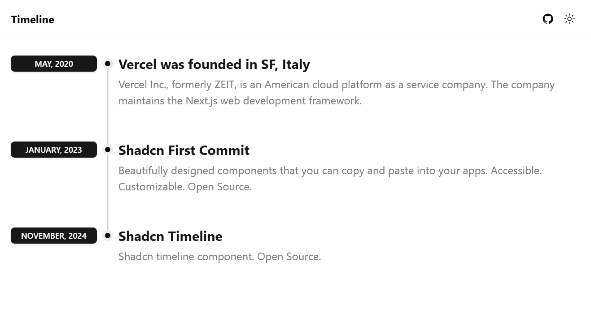

# [Shadcn Timeline](https://timeline.rilcy.app)

This is a shadcn timeline component

[](https://table.sadmn.com)

## Usage
1. Copy this component into your project
 
    ```bash
    /src/app/components/timeline/timeline-layout.tsx & timeline.tsx
    ```

2. Install Badge component from [shadcn/ui](https://ui.shadcn.com/docs/components/badge)

    ```bash
    pnpm dlx shadcn@latest add badge
    ```


## Tech Stack

- **Framework:** [Next.js](https://nextjs.org)
- **Styling:** [Tailwind CSS](https://tailwindcss.com)
- **UI Components:** [shadcn/ui](https://ui.shadcn.com)

## Running Locally

1. Clone the repository

   ```bash
   git clone https://github.com/Tourniercy/shadcn-timeline
   ```

2. Install dependencies using pnpm

   ```bash
   pnpm install
   ```

3. Start the development server

   ```bash
   pnpm run dev
   ```